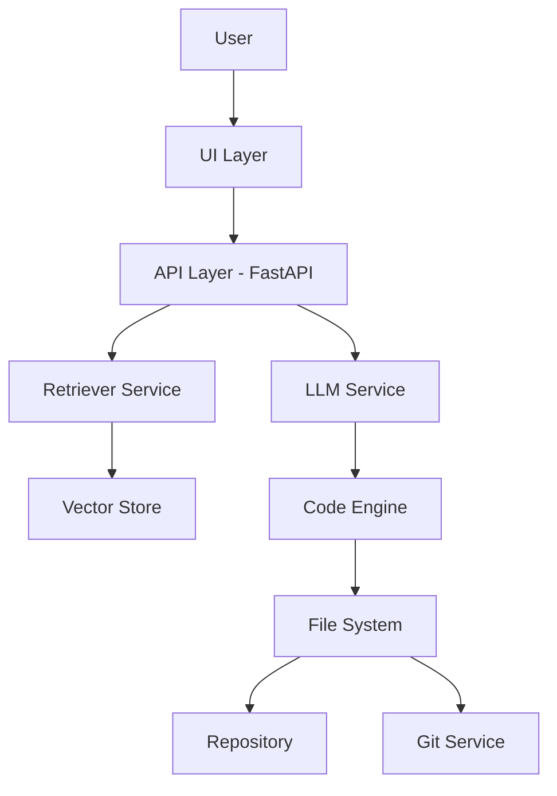

# Intelligent Code Platform

> **Turn your codebase into an intelligent, self-evolving system**

---

## Overview

**Intelligent Code Platform** is an enterprise-grade AI-powered development assistant that understands your codebase and generates production-ready code using **Retrieval-Augmented Generation (RAG)**.

It acts like a **senior developer for your project**, capable of:

* Understanding your existing code
* Generating new features
* Updating files automatically
* Maintaining consistency across your system

---

## Key Features

* 🔍 **Semantic Code Search** – Understand code context, not just text
* 🧠 **AI Code Generation** – Generate production-ready code
* 🛠️ **Auto Code Writing** – Modify and create files automatically
* 🔄 **Git Integration** – Auto commit changes
* 🧩 **Modular Architecture** – Scalable and maintainable
* 🐳 **Dockerized Setup** – Easy deployment
* 🏠 **Self-hosted LLM Support** – Runs locally using Ollama
* 🔐 **Secure API Access** – API key-based authentication

---

## 🏗️ Architecture Diagram



---

## 📸 Demo Screenshots (Layout)

### 🖥️ Chat Interface

```
+--------------------------------------+
| 💻 AI Code Assistant                 |
|--------------------------------------|
| You: Add JWT authentication          |
| AI: Generated code...                |
|--------------------------------------|
| [ Ask something... ] [Send]          |
+--------------------------------------+
```

---

### 📂 Code Update Preview

```
File: repo/auth.py

--- OLD --------------------
def login():
    pass

--- NEW --------------------
def login():
    token = create_jwt(user)
    return token
```

---

### 🔄 Git Auto Commit

```
✔ Changes committed successfully
Message: "AI code update"
Files changed: auth.py
```

---

## 🛠️ Tech Stack

| Layer        | Technology              |
| ------------ | ----------------------- |
| Backend      | FastAPI                 |
| AI Framework | LangChain               |
| LLM          | Code Llama (via Ollama) |
| Vector DB    | FAISS                   |
| DevOps       | Docker                  |
| Versioning   | Git                     |

---

## 📦 Installation

### 1️⃣ Clone Repository

```bash
git clone https://github.com/your-username/intelligent-code-platform.git
cd intelligent-code-platform
```

---

### 2️⃣ Install Dependencies

```bash
pip install -r requirements.txt
```

---

### 3️⃣ Setup LLM (Ollama)

```bash
ollama pull codellama
```

---

### 4️⃣ Index Your Codebase

```bash
python app/ingestion/ingest.py
```

---

### 5️⃣ Run with Docker

```bash
docker-compose up --build
```

---

## 🔐 API Usage

### Endpoint:

```
POST /generate
```

### Headers:

```
x-api-key: secure-key
```

### Request:

```json
{
  "question": "Add JWT authentication to my FastAPI app"
}
```

---

## 📁 Project Structure

```
ai-code-assistant/
├── app/
│   ├── core/
│   ├── ingestion/
│   ├── retrieval/
│   ├── llm/
│   ├── services/
│   ├── api/
│   └── utils/
├── repo/
├── data/
├── Dockerfile
├── docker-compose.yml
└── requirements.txt
```

---

## Production Considerations

Before deploying in real-world environments:

* ✅ Add JWT-based authentication
* ✅ Implement role-based access control (RBAC)
* ✅ Add logging (ELK / Grafana)
* ✅ Enable rate limiting
* ✅ Validate AI-generated code before writing
* ✅ Add approval workflow (human-in-loop)

---

## Roadmap

* [ ] Multi-agent system (Planner + Coder + Reviewer)
* [ ] React dashboard UI
* [ ] Code diff approval system
* [ ] CI/CD integration
* [ ] Cloud deployment (AWS / GCP)
* [ ] Multi-user collaboration

---

## GitHub Badges

Add these to top of your README:

```


```

---

## Contributing

Contributions are welcome!

1. Fork the repo
2. Create a feature branch
3. Commit changes
4. Open a Pull Request

---

## License

This project is licensed under the **MIT License**

---

## Final Thought

> This is not just a tool — it’s a foundation for building **AI-powered development platforms**.

---
## Support

If you like this project:

* Star the repo
* Fork it
* Build your own AI tools

---

**Built with to redefine software development**
