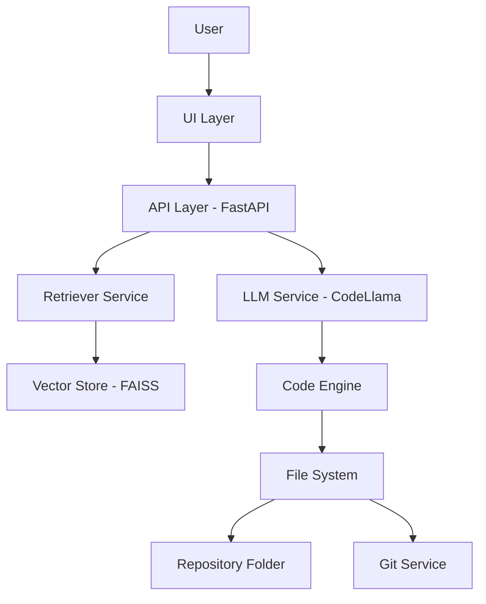

# Intelligent Code Platform


> **Turn your codebase into an intelligent, self-evolving system**

---

## Overview

**Intelligent Code Platform** is an enterprise-grade AI-powered development assistant that understands your codebase and generates production-ready code using **Retrieval-Augmented Generation (RAG)**.

It acts like a **senior developer for your project**, capable of:

* Understanding your existing code
* Generating new features
* Updating files automatically
* Maintaining consistency across your system

---

## Key Features

* 🔍 **Semantic Code Search** – Understand code context, not just text
* 🧠 **AI Code Generation** – Generate production-ready code with JSON-driven accuracy
* 🛠️ **Auto Code Writing** – Modify and create files automatically
* 🔄 **Git Integration** – Auto commit changes to the `./repo` directory
* 🐳 **Dockerized Setup** – Full stack orchestration with model persistence
* 🏠 **Self-hosted LLM Support** – Runs locally using Ollama
* 🔐 **Secure API Access** – API key-based authentication

---

## 🏗️ Architecture Diagram



---

## 🛠️ Tech Stack

| Layer        | Technology              |
| ------------ | ----------------------- |
| Backend      | FastAPI                 |
| AI Framework | LangChain               |
| LLM          | Code Llama (via Ollama) |
| Embeddings   | all-minilm (via Ollama) |
| Vector DB    | FAISS                   |
| DevOps       | Docker                  |
| Versioning   | Git                     |

---

## 📦 Installation & Setup

### 1️⃣ Clone Repository

```bash
git clone https://github.com/your-username/intelligent-code-platform.git
cd intelligent-code-platform
```

### 2️⃣ Initialize Target Repository
The platform interacts with code inside the `repo/` folder. Ensure it is a valid Git repository for auto-commits to work:
```bash
git init repo/
```

### 3️⃣ Run with Docker
Start the backend, frontend, and Ollama services:
```bash
docker-compose up -d --build
```

### 4️⃣ Setup AI Models
The platform requires two models. Download them into the Ollama container:
```bash
docker exec -it ollama ollama pull codellama
docker exec -it ollama ollama pull all-minilm
```
*Note: These models are stored in `./ollama_data` and will persist across service restarts.*

### 5️⃣ Index Your Codebase
Once the models are pulled, generate the semantic index for your code:
```bash
docker exec ai-backend env PYTHONPATH=. python app/ingestion/ingest.py
```

---

## 🚀 Native GPU Support (Optional)
By default, the system runs on **CPU**. If you have an NVIDIA GPU, you can significantly speed up generation by adding the following to the `ollama` service in `docker-compose.yml`:

```yaml
    deploy:
      resources:
        reservations:
          devices:
            - driver: nvidia
              count: all
              capabilities: [gpu]
```
*Requirement: Ensure the **NVIDIA Container Toolkit** is installed on your host OS.*

---

## 🔐 API Usage

### Endpoint: `POST /generate`
**Headers:**
```
x-api-key: secure-key
Content-Type: application/json
```
**Request Body:**
```json
{
  "question": "Add a health check endpoint to repo/main.py"
}
```

---

## 📁 Project Structure

```
ai-code-platform/
├── app/                # Backend Application (FastAPI)
│   ├── api/            # API Routes & Endpoints
│   ├── core/           # Config & Security
│   ├── ingestion/      # RAG Ingestion (ingest.py)
│   ├── llm/            # LLM Engine & JSON Mode
│   ├── retrieval/      # FAISS Retriever Service
│   ├── services/       # Code Generation Logic
│   └── utils/          # File Management
├── frontend/           # Frontend Application (Next.js)
│   ├── app/            # Next.js Pages
│   ├── components/     # React Components (Editor, Chat)
│   └── public/         # Static Assets
├── repo/               # Target workspace for AI to modify
├── data/               # Vector Store (index.faiss, index.pkl)
├── ollama_data/        # Persistent model storage for Ollama
├── Dockerfile          # Backend container definition
├── docker-compose.yml  # Full stack orchestration
├── requirements.txt    # Python dependencies
└── README.md           # Project documentation
```

---

## 🏁 Final Thought

> This is not just a tool — it’s a foundation for building **AI-powered development platforms**.

**Built with pride to redefine software development**
